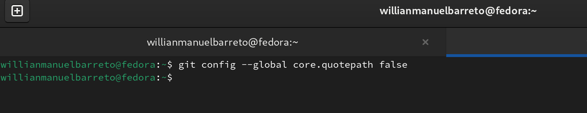
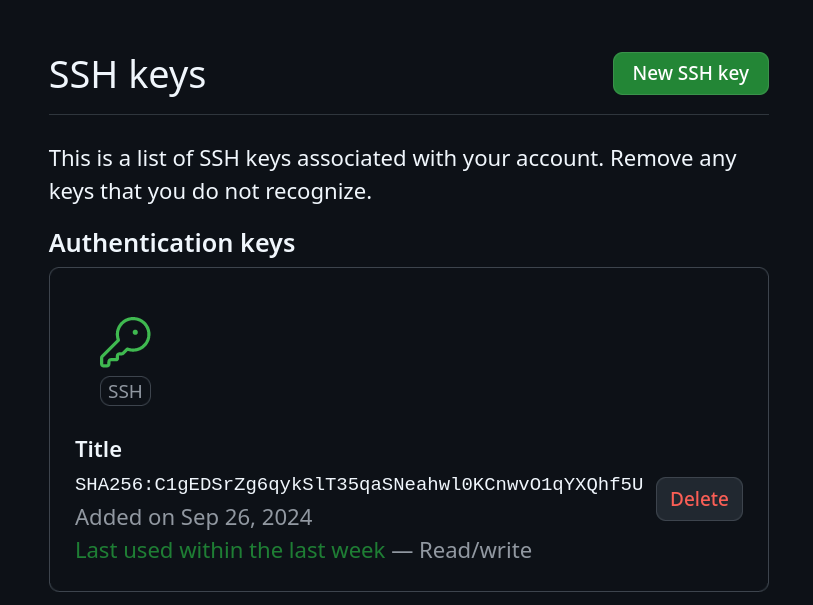

---
## Front matter
title: "Лабораторной работе №3"
subtitle: "Язык разметки Markdown"
author: "Барето Вилиан Мануел"

## Generic otions
lang: ru-RU
toc-title: "Содержание"

## Bibliography
bibliography: bib/cite.bib
csl: pandoc/csl/gost-r-7-0-5-2008-numeric.csl

## Pdf output format
toc: true # Table of contents
toc-depth: 2
lof: true # List of figures
lot: true # List of tables
fontsize: 12pt
linestretch: 1.5
papersize: a4
documentclass: scrreprt
## I18n polyglossia
polyglossia-lang:
  name: russian
  options:
	- spelling=modern
	- babelshorthands=true
polyglossia-otherlangs:
  name: english
## I18n babel
babel-lang: russian
babel-otherlangs: english
## Fonts
mainfont: IBM Plex Serif
romanfont: IBM Plex Serif
sansfont: IBM Plex Sans
monofont: IBM Plex Mono
mathfont: STIX Two Math
mainfontoptions: Ligatures=Common,Ligatures=TeX,Scale=0.94
romanfontoptions: Ligatures=Common,Ligatures=TeX,Scale=0.94
sansfontoptions: Ligatures=Common,Ligatures=TeX,Scale=MatchLowercase,Scale=0.94
monofontoptions: Scale=MatchLowercase,Scale=0.94,FakeStretch=0.9
mathfontoptions:
## Biblatex
biblatex: true
biblio-style: "gost-numeric"
biblatexoptions:
  - parentracker=true
  - backend=biber
  - hyperref=auto
  - language=auto
  - autolang=other*
  - citestyle=gost-numeric
## Pandoc-crossref LaTeX customization
figureTitle: "Рис."
tableTitle: "Таблица"
listingTitle: "Листинг"
lofTitle: "Список иллюстраций"
lotTitle: "Список таблиц"
lolTitle: "Листинги"
## Misc options
indent: true
header-includes:
  - \usepackage{indentfirst}
  - \usepackage{float} # keep figures where there are in the text
  - \floatplacement{figure}{H} # keep figures where there are in the text
---

# Цель работы

Ознакомиться с языком разметки Markdown и оформить отчет по лабораторной работе 
№2 в ней.

# Задание

Сформировать отчет по лабораторной работе №2 с помощью Markdown.

# Теоретическое введение

Здесь описываются теоретические аспекты, связанные с выполнением работы.

Например, в табл. [-@tbl:std-dir] приведено краткое описание стандартных каталогов Unix.

: Описание некоторых каталогов файловой системы GNU Linux {#tbl:std-dir}

| Имя каталога | Описание каталога                                                                                                          |
|--------------|----------------------------------------------------------------------------------------------------------------------------|
| `/`          | Корневая директория, содержащая всю файловую                                                                               |
| `/bin `      | Основные системные утилиты, необходимые как в однопользовательском режиме, так и при обычной работе всем пользователям     |
| `/etc`       | Общесистемные конфигурационные файлы и файлы конфигурации установленных программ                                           |
| `/home`      | Содержит домашние директории пользователей, которые, в свою очередь, содержат персональные настройки и данные пользователя |
| `/media`     | Точки монтирования для сменных носителей                                                                                   |
| `/root`      | Домашняя директория пользователя  `root`                                                                                   |
| `/tmp`       | Временные файлы                                                                                                            |
| `/usr`       | Вторичная иерархия для данных пользователя                                                                                 |

Более подробно про Unix см. в [@tanenbaum_book_modern-os_ru; @robbins_book_bash_en; @zarrelli_book_mastering-bash_en; @newham_book_learning-bash_en].

# Выполнение лабораторной работы

1)Переходим в каталог, который привязан к репозиторию Git на сайте Github рис. [-@fig:001]).

{#fig:001 width=70%}

2)С помощью команды git pull обновляем локальный репозиторий,скачивая
изменения рис. [-@fig:002]).

{#fig:002 width=70%}

3)Переходим в каталог report 3 лабораторной работы рис. [-@fig:003]).

{#fig:003 width=70%}

4)Используем команду make для создания файлов report.pdf и report.docx рис. [-@fig:004]).

{#fig:004 width=70%}

5)Проверяем, как сработала команда makе рис. [-@fig:005]).

{#fig:005 width=70%}

6)Используем команду make clean, которая удаляет недавно созданные докумен-
ты рис. рис. [-@fig:006]).

{#fig:006 width=70%}

7)Открываем файлы и смотрим, сработала ли команда make clean рис. [-@fig:007]).

{#fig:007 width=70%}

8)Используем команду gedit report.md, которая открывает редактор данного
документа рис. [-@fig:008]).

{#fig:008 width=70%}

9)Изучаем открывшийся файл рис. [-@fig:009]).

{#fig:009 width=70%}

10)Изучив структуру файла, начинаем его изменять рис. [-@fig:0010]).

{#fig:0010 width=70%}

11)Делаем предварительную конфигурацию git рис. [-@fig:0011]).

{#fig:0011 width=70%}

12)Настраиваем utf-8 в выводе сообщения git рис. [-@fig:0012]).

{#fig:0012 width=70%}

13)Задаем имя начальной ветки. рис. [-@fig:0013]).

{#fig:0013 width=70%}

14)Задаем имя начальной ветки, как maste рис. [-@fig:0014]).

{#fig:0014 width=70%}

15)Устанавливаем настройку autocrlf рис. [-@fig:0015]).

{#fig:0015 width=70%}

16)Устанавливаем параметр safecrlf рис. [-@fig:0016]).

{#fig:0016 width=70%}

17)Создаем SSH ключ рис. [-@fig:0017]).

{#fig:0017 width=70%}

18)Генерируем пару ключей командой keygen рис. [-@fig:0018]).

{#fig:0018 width=70%}

19)Копируем ключ из локальной консоли в буфер обмен рис. [-@fig:0019]).

{#fig:0019 width=70%}

20)Заходим в свой аккаунт на сайте github. Переходим в настройки, SSH ключи

рис. [-@fig:0020]).

{#fig:0020 width=70%}

21)вставляем ключ и сохраняем рис. [-@fig:0021]).

{#fig:0021 width=70%}

22)Проверяем добавление ключа рис. [-@fig:0022]).

{#fig:0022 width=70%}

23)Открываем терминал и создаем каталоги для предмета “Архитектура компьютера рис. [-@fig:0023]).

{#fig:0023 width=70%}

24)Создаем каталоги последовательно рис. [-@fig:0024]).

{#fig:0024 width=70%}

25)Переходим на страницу репозитория с шаблоном рис. [-@fig:0025]).

{#fig:0025 width=70%}

26)Переходим в папку с предметом рис. [-@fig:0026]).

{#fig:0026 width=70%}

27)Переходим в каталог курса рис. [-@fig:0027]).

{#fig:0027 width=70%}

28)Переходим в каталог arch-pc(Клонируем созданный репозиторий рис. [-@fig:0028]).

{#fig:0028 width=70%}

29)Отправляем фалы на git рис. [-@fig:0029]).

{#fig:0029 width=70%}

30)Отправляем прошлую лабораторную работу рис. [-@fig:0030]).

{#fig:0030 width=70%}

# Выводы

Здесь кратко описываются итоги проделанной работы.

# Список литературы{.unnumbered}

::: {#refs}
:::
